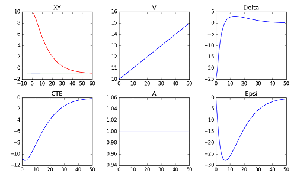
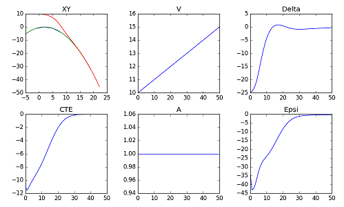
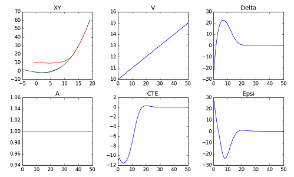

# CarND-Controls-MPC
Self-Driving Car Engineer Nanodegree Program - Project Write-Up

---

## Code Structure

_main.cpp_:
  * Line 118: transforming waypoints from global to car coordinates
  * Line 122: fitting a 3rd degree polynomial to the way points
  * Line 137: setting the initial state to account for the 100ms Latency
  * Line 147: invoking the solver to find optimal trajectory
  * Line 155: normalizing & reversing the steering angle

_MPC.cpp_:
  * Line 9: hyperparameter settings
  * Line 45-61: FG_eval cost function
  * Line 64-101: FG_eval constraints representing the vehicle model
  * Line 129: prepare initial values and bounds of state, actuator variables, and constraints
  * Line 202: invoke Ipopt to find the minimum-cost trajectory
  * Line 211: output the trajectory for visualization

_utils.cpp_:
  * Line 3: helper function to convert global coords to car coords
  * Line 23: function to compute the coeffs of the derivative of a polynomial

## Details

### How I approached the project

I began by modifying the code from the MPC quiz to use 3rd degree polynomial.  Then testing with
various waypoints, I visualized the solutions returned by the optimizer to verify that they merge
correctly with the reference trajectories, and that actuator variables change smoothly over time.

In the following 3 figures, I show plots of the solution trajectories and reference trajectories
in the first cell, and the time curves for state and actuator variables in the other cells.

**Straight trajectory**



**Curve right**



**Curve left**



During this step, I also tuned the weights of the various components of the cost function. Once I
was happy with the parameter settings, I moved the code into the project.  The rest of the work
involved coordinate transformation, polynomial fitting, setting up initial state, and handling latency.

### Model Description

The vehicle model is a bicycle model, its state consists of 4 variables: `x`, `y`, heading `psi`, and
speed `v`.  We augment the state to include the cross-track error `cte` (distance from reference trajectory),
and orientation error `epsi` (actual heading vs desired heading).  There are two actuator variables:
steering angle `delta` and acceleration `a`.

Update equations are as follows, after time step `dt`:
- x1 = x0 + (v0 * cos(psi0) * dt)
- y1 = y0 + (v0 * sin(psi0) * dt)
- psi1 = psi0 + (v0 * delta0 / Lf * dt)
- v1 = v0 + (a0 * dt)
- cte1 = (f0 - y0) + (v0 * sin(epsi0) * dt)
- epsi1 = (psi0 - psides0) + (v0 * delta0 / Lf * dt)

Where `Lf` is a calibration parameter, obtained by driving the car in the simulator in a circle on flat
terrain at constant speed and steering angle, and choosing a value that result in the matching radii
between the simulator and the model.

`f0` is the y value of the reference trajectory at x0, and `psides0` is the desired orientation at x0.
This desired orientation is the slope of the tangent to the reference trajectory at x0, calculated as f'(x0).

### Contraints and Cost Function

The motion model is implemented as a series of constraints on the values of state/actuator variables between
consecutive timesteps (MPC.cpp line 64-101).  The optimizer Ipopt chooses actuator values for each timestep
that satisfy the model constraints while minimizing the cost function.

The cost function (MPC.cpp line 45-49) primary purpose is to align the model-predicted trajectory and the
reference trajectory.  Therefore its primary components are the `cte` and `epsi`.  Since `epsi` values are
in radians and are small, I multiply it by 100 to give it more weight compared to the `cte`.

Secondary purpose of the cost function is to "discourage" sharp turning and sharp acceleration.  So we
include `delta` and `a` in the cost (MPC.cpp line 52-55).

Finally we also want to smooth out the steering and acceleration curves by discouraging abrupt changes.  We
do this by including the first derivatives of `delta` and `a` in the cost also (MPC.cpp line 58-61).

### Timestep Length & Horizon

When tuning these parameters, I find that with a large time horizon (e.g. +3 seconds) we end up
trying to polyfit many waypoints that may cover multiple curves on the road, and end up with bad polynomial
that totally screws up the solver.  In the end, the rule seems to be to keep `N*dt` within 1.5 seconds.

How big `N` and how small `dt` is a matter of resolution, a trade-off between performance and roughness of
the result trajectory.  A large `dt` appears to cause corner-cutting at sharp curves.  A small `dt` may
causes higher CPU.  In the end, I choose `dt=.1` and `N=10`, which seems to be on the rough side, but
nonetheless works well.

### Polynomial Fitting

The polynomial fitting (main.cpp line 122) is performed in the car's coordinate system.  So before fitting,
the waypoints provided by the simulator in map coordinates need to be transformed to into car coordinates
(main.cpp line 118).  This is a standard linear transformation involving a reverse translation of the car
position followed by a reverse rotation of its orientation.

The vehicle state returned by the simulator is unprocessed, except for the steering angle, which is reversed
and multiplied by the actual _max_steering_angle_ of the car (main.cpp line 99).  The opposite happens when
we need to send steering actuations to the simulator (main.cpp line 155).

### Dealing With Latency

As suggested in lecture, to handle the 100ms latency, I use the model to predict where the car will be after
100ms and use that as the initial state to the solver (main.cpp line 137).  This is so that the solution
returned by the solver matches the time the actuation actually takes effect on the car.

### Video Demo

[](https://www.youtube.com/watch?v=Qavvjt_IQ7w)

## Dependencies

* cmake >= 3.5
    * All OSes: [click here for installation instructions](https://cmake.org/install/)
* make >= 4.1(mac, linux), 3.81(Windows)
    * Linux: make is installed by default on most Linux distros
    * Mac: [install Xcode command line tools to get make](https://developer.apple.com/xcode/features/)
    * Windows: [Click here for installation instructions](http://gnuwin32.sourceforge.net/packages/make.htm)
* gcc/g++ >= 5.4
    * Linux: gcc / g++ is installed by default on most Linux distros
    * Mac: same deal as make - [install Xcode command line tools]((https://developer.apple.com/xcode/features/)
    * Windows: recommend using [MinGW](http://www.mingw.org/)
* [uWebSockets](https://github.com/uWebSockets/uWebSockets)
    * Run either `install-mac.sh` or `install-ubuntu.sh`.
    * If you install from source, checkout to commit `e94b6e1`, i.e.
    ```
    git clone https://github.com/uWebSockets/uWebSockets
    cd uWebSockets
    git checkout e94b6e1
    ```
    Some function signatures have changed in v0.14.x. See [this PR](https://github.com/udacity/CarND-MPC-Project/pull/3) for more details.

* **Ipopt and CppAD:** Please refer to [this document](https://github.com/udacity/CarND-MPC-Project/blob/master/install_Ipopt_CppAD.md) for installation instructions.
* [Eigen](http://eigen.tuxfamily.org/index.php?title=Main_Page). This is already part of the repo so you shouldn't have to worry about it.
* Simulator. You can download these from the [releases tab](https://github.com/udacity/self-driving-car-sim/releases).
* Not a dependency but read the [DATA.md](./DATA.md) for a description of the data sent back from the simulator.


## Basic Build Instructions

1. Clone this repo.
2. Make a build directory: `mkdir build && cd build`
3. Compile: `cmake .. && make`
4. Run it: `./mpc`.
